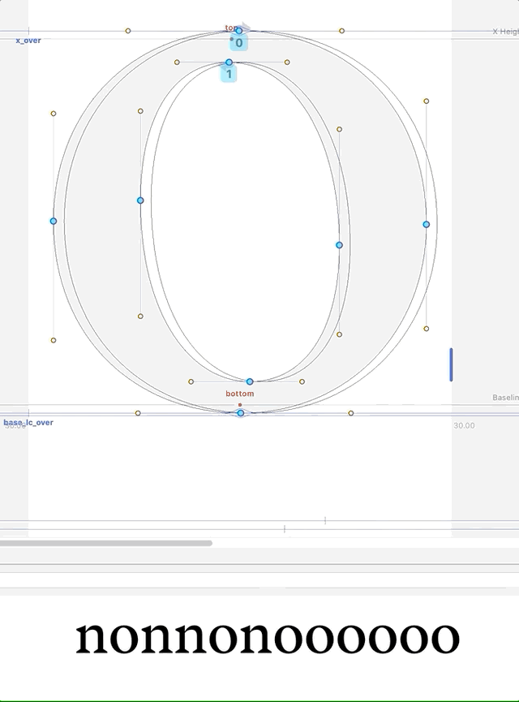

Option-dragging one margin will change the other margin accordingly. Maybe this should be combined with [Margin Selection Tool](https://github.com/ryanbugden/marginSelectionTool)!

Idea is 100% Frank Grießhammer.

Known issues:  
* When dragging LSB, RSB does not update until mouseUp.  
* When dragging RSB, RSB is not aligned with mouse position.  
* Some lag after use.

v0.1.0:   2019.12.20  

This is a script currently meant to be implemented as a [start-up script](https://robofont.com/documentation/how-tos/setting-up-a-startup-script/?highlight=start-up).

